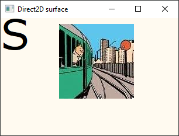

### Compile

In a VS2022 developer command prompt run `build.bat`. The output is
written to the directory `draw\build`, and `draw.exe` is in there.

    cd src
    build.bat

### Run

    cd build
    draw.exe

### Output

May 12 2023

